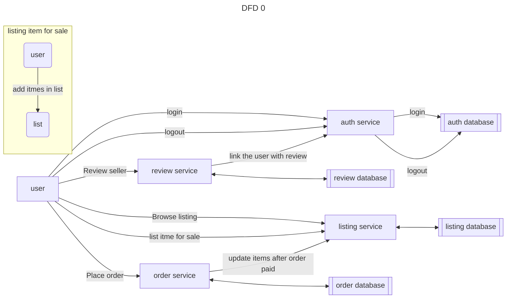
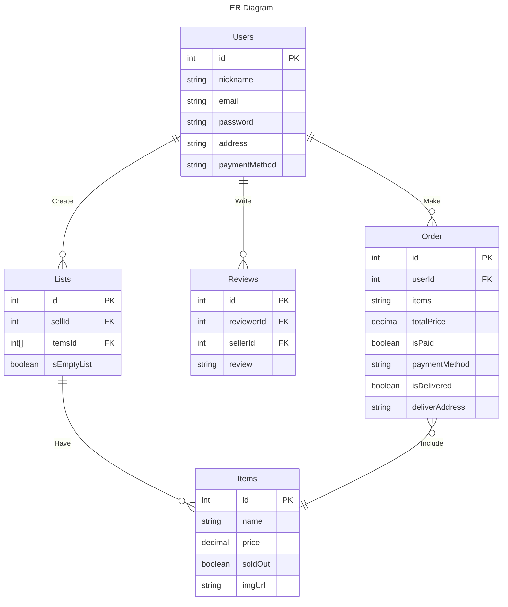

# easv.pbsw.dbd.compulsory-assignment-2

## Scenario

Design and implement the backend of an e-commerce platform specializing in second-hand items.

The platform allows users to

- List items for sale
- Browse listings
- Place orders
- Review sellers

## Demand analysis

### Structured Analysis

### ER diagram

### Database Selection

根据上面的两个图表的分析, 我可以判断出下面的条件:

- review 和 item 都是独立的记录, 会存在大量重复, 并且是读取较多,写入较少的情况(当用户打开某个列表的时候, 应当加载 review 和 items). 所以把他们保存在 documenting database.
- user, order, list 之间关联较大, 较为适合存放入关系型数据库中. 他们一般写入较多.

### Data Schema and Storage Strategy

### Integration of Cloud Storage

### Caching Strategy

### CQRS Implementation

### Transaction Management
