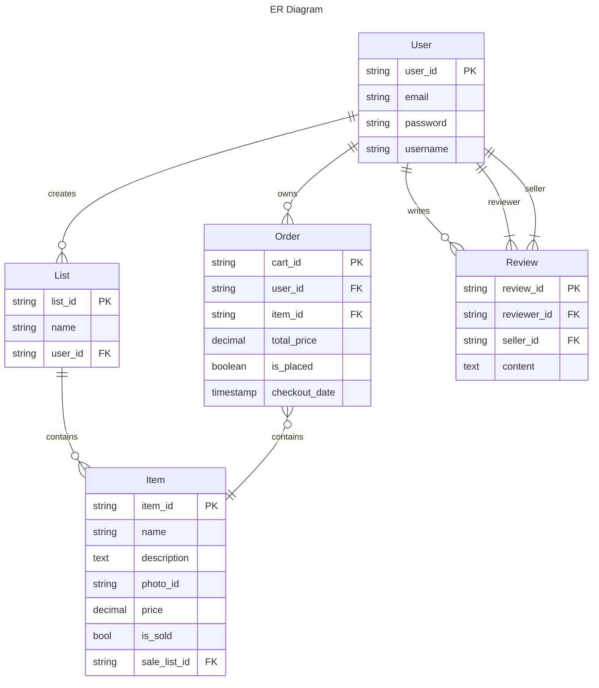

# easv.pbsw.dbd.compulsory-assignment-2

## Demand analysis

### ER diagram



### Database selection

The core of database selection lies in adhering to the principles of CQRS,
where the read and write responsibilities are segregated to different databases for processing.

The write responsibility which is command are handled by the relational database PostgreSQL.

This is because relational databases are better at handling transactions and ensuring data consistency (ACID), such as updating the corresponding database based on different conditions.

Moreover, the relational table schema is more suitable for separating complex write responsibility (which is Query), and validation operations into individual table operations. For example, for a user's order behavior, it can be simply divided into updating the `is_placed` attribute of the order table and the `is_sold` attribute of the corresponding items.

The query is performed by the document-based non-relational database MongoDB. It can directly customize the data structure for query, has fast query speed, excellent scalability, and is also convenient for cache design.

### Data Schema and Storage Strategy

The PostgreSQL relational database is mainly responsible for command. The tables are designed based on the previous ER diagram. This part of the data is structured in the form of tables and is persistently stored on the remote server according to the ER diagram. When data is removed, the original data is not directly deleted; instead, a `delete_time` attribute is added to the data tuples to mark the removal.

```ts
type User = {
  id: number; // PK
  email: string;
  password: string;
  username: string;
  delete_time: Date | null;
};

type Item = {
  id: number; //PK
  sellerId: number; //FK User.id
  name: string;
  description: string;
  price: number;
  imageUrl: string;
  isSold: boolean;
  delete_time: Date | null;
};

type Order = {
  id: number; //PK
  buyerId: number; //FK
  isPlaced: boolean;
  checkoutDate: Date;
  totalAmount: number;
  delete_time: Date | null;
};

type OrderItems = [
  {
    id: number;
    orderId: number;
    itmeId: number;
  },
];

type Review = {
  id: number;
  reviewerId: number;
  sellerId: number;
  content: string;
  delete_time: Date | null;
};
```

For the query design, since it is a second-hand market application, each user who wants to sell something will create a unique list, and the items in this list are also unique.

Therefore, we can completely adopt an embedded schema to directly embed the `list` and `item` details into the `user` schema. In this way, when reading the list, all users' list relevent details can be read out. As the reviews mentioned in the requirements that are comments for a certain seller, the reviews can also be embedded in the user table. When user reviewing, it is only necessary to obtain the comments contained in the `user`.

However, for the order records, each order not only contains the information of the buyer, but also the information of each seller's items in different list. If embedded into the buyer's table, it would make the retrieval of each item extremely complicated.

Therefore, creating a separate order table and linking each order's buyer and the items detail (including the seller's information) to the corresponding items in the user list would make the retrieval much simpler compared to integrating them into the user table.

The data in this part is also persistently stored on the remote server. When the data in the relational database is marked for removal, the corresponding data in the non-relational database is synchronized to be removed. No removal marks are added here. instead, the removal is carried out directly. This is done to ensure that the storage of read data can minimize the volume of data storage, thereby facilitating the improvement of reading and retrieval efficiency. At the same time, it can save cache space and enhance cache capacity.

```json
{
    user: {
        id: number,
        username: string,
        email: string,
        listItems: [
            {
                id: number,
                name: string,
                description: string,
                price: number,
                image_url: string,
                is_sold: boolean
            }
        ],
        review: [
            {
                id: number,
                reviewer_id: number,
                content: string
            }
        ]
    },
    orders: [
        {
            id: number,
            buyer_id: number,
            is_checkout: boolean,
            checkout_date: datetime,
            totol_amount: number
            items: [
                {
                    seller_id: number,
                    item_id: number
                }
            ]
        }
    ]
}
```

### Integration of Cloud Storage

For the large, unstructured, static resources such as item images, we can upload them to cloud storage. Then, after obtaining the `image_url` attribute from the item details data on the front end, we can directly request the image data from the cloud storage service, thus avoiding occupying the bandwidth of the private server and affecting the read and write efficiency of the database.

In cloud storage servers, a simple implementation method is to use object storage services, such as: Azure Blob Storage, Google Cloud Storage, AWS S3 or Google Firebase Storage.

For example: Google Firebase storage can be introduced in the front-end by importing the npm package `firebase`. After setting up the connection (this can be done by storing the connection information in an env file, or by requesting it from the backend), users can directly upload images to Firebase. Once the image upload is completed, the front-end will receive the URL information returned by Firebase, which is the `image_url` value of the item details. After the user completes adding the item, this value will be stored along with other data in the `items` table of PostgreSQL (and also synchronized to the `user.list_items.image_url` in MongoDB). When the user browses the details of an item in the list, the front-end will obtain this URL and initiate a request to Firebase to load the returned image data.

### Caching Strategy

For query that may have a large number of concurrent requests, we can use Redis for caching to improve the query efficiency of frequently used data.

When it comes to query on MongoDB, we can adopt the Cache-Aside caching strategy to cache popular list data and user review data. The read and write synchronization of this part of data is not so high in terms of timeliness. By using this cache-aside caching strategy, the cached data can be returned to the user more quickly.
At the same time, set the TTL to 5 minutes to ensure that the cached data can be updated in a timely manner.

However, for the caching of items related to the order data, the Write-Through strategy should be used. Due to the uniqueness of the items, once an item is sold, the other users' saved orders should be updated in the cache to indicate that the item has been sold. This operation requires timeliness to ensure that the same item is not sold repeatedly. This strategy can utilize the Pub/Sub feature of Redis. By subscribing to the query of the `is_sold` attribute of the cached items in PostgreSQL, and once the write operation is completed, a notification to update the cache and notify Redis is sent.

### CQRS Implementation

The read-write separation strategy in this project is implemented by separating the data storage. This strategy enables dynamic database expansion and contraction by creating multiple instances when the request volume for a certain responsibility increases. Thus, it can alleviate the pressure on the database server.

However, the scale capacity based on this approach will significantly increase the complexity of database design and implementation. It is necessary to ensure strong data consistency (ACID), that is, after the write operation is completed, how to synchronize both read and write databases and ensure consistency among all instances. Is the thing that need to considering.

### Transaction Management

For the complete implementation of database transactions, it is an important requirement to ensure data consistency across multiple distributed databases, as well as continuous synchronization and update among database instances and within the database itself.

The atomicity of database transactions is demonstrated in the update of order data. Once an order is paid, when the order table in the database is updated, the isSold attribute of all items involved in the order table also needs to be updated synchronously. If the order update fails, the payment fails, and the isSold attribute of all involved items will not be changed, and the items can still be purchased.

If the same item is purchased by different users simultaneously, then the purchase operation accepted by the later user must wait until the previous operation is completed before it can be executed. If the previous operation is successful, the subsequent operation is regarded as a failure, and the subsequent order needs to be rolled back to the previous state. This simultaneously embodies the characteristics of consistency failure and isolation failure.
