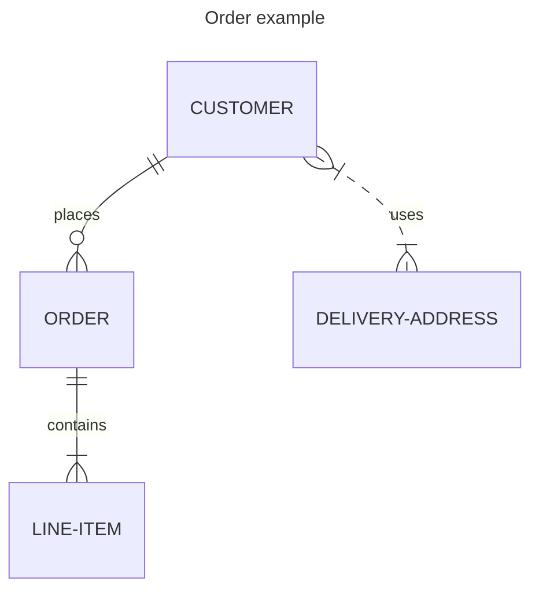

# easv.pbsw.dbd.compulsory-assignment-2

## Project Design

The key scenario shows that platform that service to user to do the operation for their second-hand trade.
Which included following entities:

- users: Indentical as the logined user and sellers.
- items: The stuff for sell. In this senario, the list will generate by searching or filting.
- order: The user choose multiple items and calculate/generate as the receipt(in the assignment case, that will not implement the payment solutions).
- review info: Which will included the comment and points by user to pointing to a seller.

### ER diagram

## Answering Design & Implementation questions

### Database Selection

### Data Schema and Storage Strategy

### Integration of Cloud Storage

### Caching Strategy

### CQRS Implementation

### Transaction Management
